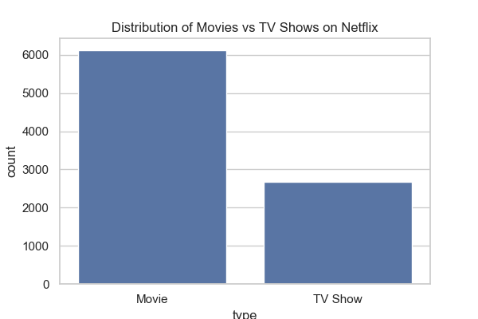
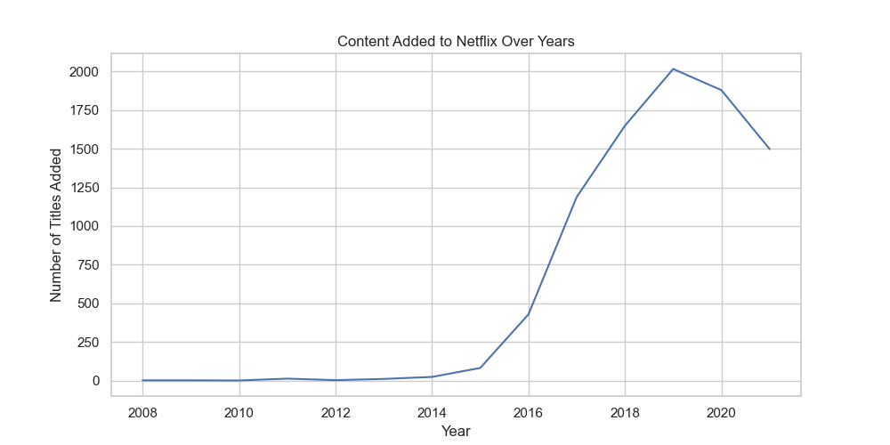
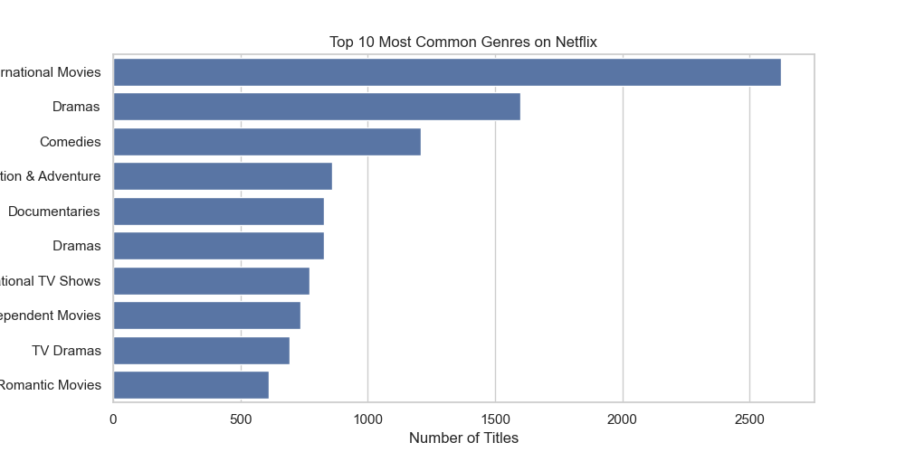
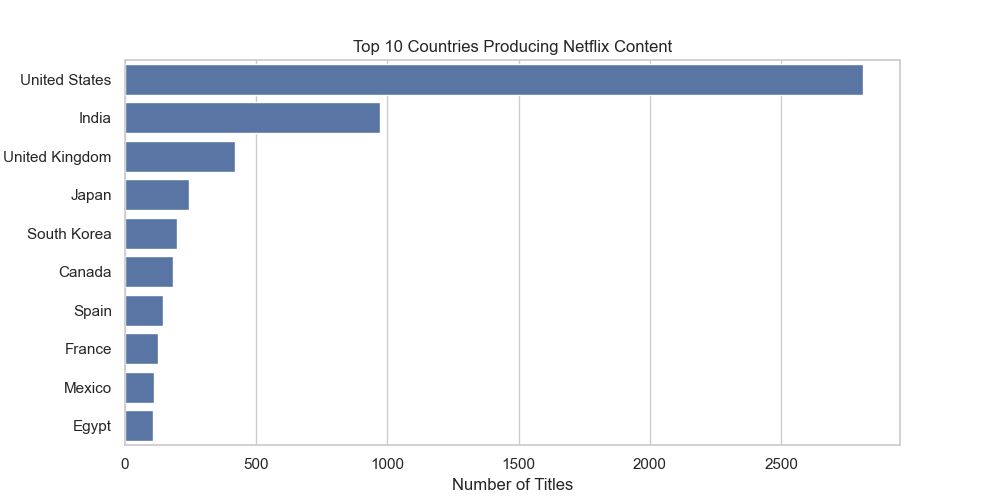

# 📊 Netflix Data Analysis & Business Insights

## 📌 Project Overview

This project analyzes Netflix Movies and TV Shows dataset to uncover trends, content distribution, and business insights using Python and data visualization techniques.

The analysis focuses on:
- Content type distribution
- Growth of Netflix content over years
- Most popular genres
- Top producing countries

---

## 🛠 Tech Stack

- Python
- Pandas
- NumPy
- Matplotlib
- Seaborn
- Jupyter Notebook

---

## 📂 Dataset

The dataset includes:
- Title
- Type (Movie / TV Show)
- Country
- Genre
- Release Year
- Date Added
- Rating
- Duration
- Description

---

# 📊 Key Insights

---

## 1️⃣ Movies vs TV Shows

- Netflix has significantly more Movies (~6000) than TV Shows (~2500).
- Movies dominate the content library.

---

## 2️⃣ Content Growth Over Years

- Rapid expansion between 2016–2019.
- Peak content addition around 2019.
- Slight decline observed after 2019.

---

## 3️⃣ Top Genres

- International Movies are the most common category.
- Drama and Comedy follow closely.
- Strong global content diversification.

---

## 4️⃣ Top Countries

- United States produces the highest number of titles.
- India is the second-largest contributor.
- Strong representation from Asian countries.

---

## 🚀 How to Run

1. Clone the repository:
git clone https://github.com/aniket252005/netflix-data-analysis.git

2. Navigate to project folder:
cd netflix-data-analysis

3. Install dependencies:
pip install -r requirements.txt

4. Open notebook:
jupyter notebook

---

## 👤 Author

**Aniket Pandey**  
Aspiring Data Scientist  
Python | SQL | Data Analysis | Machine Learning